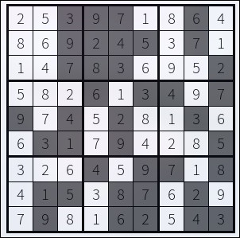

Code: `main.circom` \
Input: `input.json` \
Picture for this input:
- Gray - given
- White - secret

Keys:
1) Proving - `keys/proof.json`
2) Verification - `keys/verification_key.json`

Smart contract:
1) Code - `keys/verifier.sol`
2) Sepolia address - `0x955289DF58760847BDdD8eE15c27Cf58Ae7d52fa`

Proof calldata: `keys/calldata.txt`

